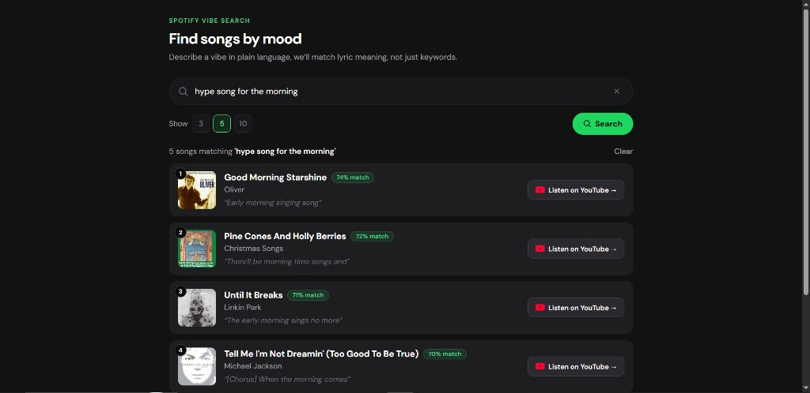

# Spotify Semantic / Vibe Search (Week 2)

Search songs by natural-language mood descriptions using Sentence Transformers + FAISS.

## Demo UI



## Design choices (evaluation)

| Question | Answer |
|---|---|
| Embedding dimension | **384** (`all-MiniLM-L6-v2`) |
| Representation | Sentence Transformers dense embeddings; same model for queries and lyric chunks |
| Long lyrics | Sentence/line **chunking**, then **max score per song** |
| Similarity | **Cosine** (L2-normalize vectors, search with FAISS `IndexFlatIP` so dot product == cosine) |
| Index | **Brute-force Flat** — exact search, high recall, fine for ~57k songs |

## Setup (local)

```bash
cd week2-exercise
pip install -r requirements.txt
```

Place CSV at `data/raw/spotify_millsongdata.csv`.

### Build index

```bash
# Deploy-sized sample (fits Render free / GitHub)
python scripts/prepare_and_index.py --max-songs 2500

# Full dataset (local only; large artifacts)
python scripts/prepare_and_index.py
```

### Run web app

```bash
uvicorn app.main:app --reload --host 127.0.0.1 --port 8000
```

Open http://127.0.0.1:8000

## Deploy on Render (free)

This repo includes `render.yaml`. Deploy-sized artifacts (`~2500` songs) are committed so the service does not rebuild the index on Render.

1. Push this `week2-exercise` folder to a **GitHub** repository.
2. Go to [https://dashboard.render.com](https://dashboard.render.com) → **New** → **Blueprint**.
3. Connect the GitHub repo and apply `render.yaml`.
4. Wait for build (installs PyTorch CPU + Sentence Transformers; first build is slow).
5. Open the `*.onrender.com` URL.

**Notes**
- Free tier **spins down** after idle; first request can take 30–60s (cold start + model load).
- Free RAM is limited; keep `--max-songs` around 2–3k on free plans.
- `artifacts/embeddings.npy` is gitignored (not needed at runtime; FAISS index is enough).

Manual service settings (if not using Blueprint):

| Setting | Value |
|---|---|
| Runtime | Python 3.11 |
| Build | `pip install -r requirements.txt` |
| Start | `uvicorn app.main:app --host 0.0.0.0 --port $PORT` |

## Pipeline

1. Load CSV → chunk lyrics → embed (384-D) → FAISS Flat IP  
2. Query → embed → search chunks → max-pool to songs → UI (+ cover / YouTube)

## Project layout

```
week2-exercise/
  app/main.py
  app/search.py
  app/media.py
  app/templates/index.html
  scripts/prepare_and_index.py
  artifacts/          # faiss.index, chunks.parquet, config.json
  docs/ui-screenshot.png
  render.yaml
  requirements.txt
```
